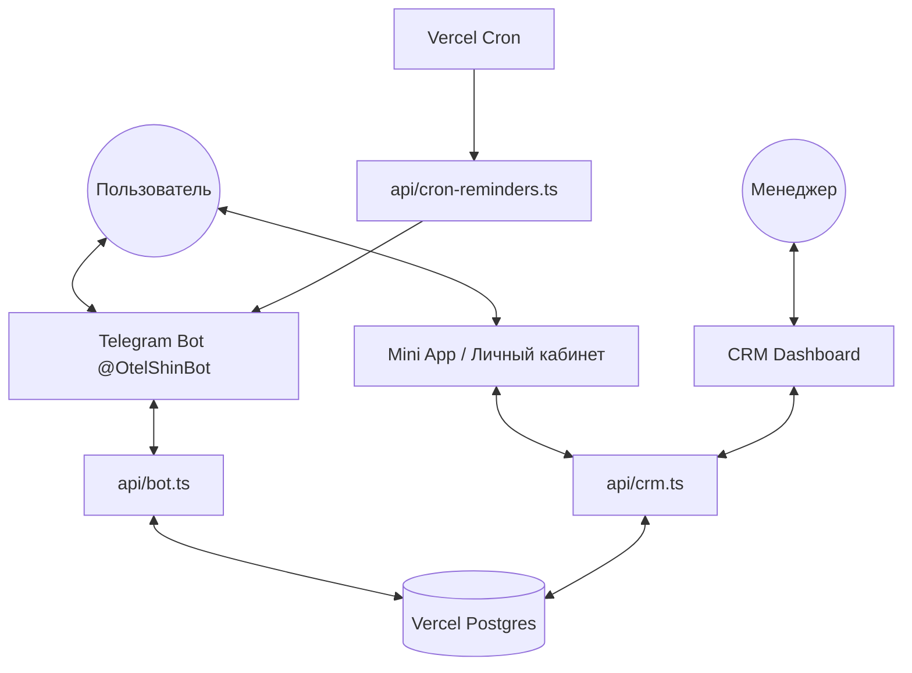

# Интеграция Telegram & Mini App (v3.0 — Vercel Native)

Интеграция переведена на Vercel Postgres и разделена на **Бот-ассистент** (текстовый интерфейс и уведомления) и **Mini App / Личный кабинет** (визуальный интерфейс).

Этот документ описывает логику взаимодействия Telegram-интеграции с базой Vercel Postgres.

## 1. Схема работы системы



## 2. Статус реализации (SQL Mode)

### ✅ РАБОТАЕТ (Ready)
*   **Авторизация:** Привязка `Chat ID` к клиенту в Postgres через "Поделиться контактом".
*   **База данных:** Хранение и извлечение данных клиента через JSONB (`metadata`).
*   **Signup Flow:** Сбор лидов (Телефон -> Авто -> Адрес) с сохранением в историю.
*   **Mini App (Вход):** Автоматическое определение пользователя через `initData`.
*   **Mini App (UI):** Отображение статуса, номера договора и даты окончания.
*   **Реферальная система:** Генерация ссылки для приглашения друзей.
*   **Импорт данных:** Исправлена ошибка импорта клиентов без ID (автогенерация).

### ⚠️ В ПРОЦЕССЕ / ТРЕБУЕТ ТЕСТОВ
*   **Webhook:** Переключение с GAS на Vercel (нужно нажать кнопку в Настройках CRM).
*   **История в ЛК:** Отображение прошлых заказов из таблицы `history` в интерфейсе Mini App.
*   **Статусы:** Синхронизация визуального прогресс-бара с реальными датами из базы.

### ❌ НЕ РЕАЛИЗОВАНО (Backlog)
*   **Кнопка "Забрать колеса":** В Mini App кнопка есть, но она не отправляет уведомление менеджеру.
*   **Кнопка "Продлить":** Не реализована логика выбора срока внутри Mini App.
*   **Фото в Mini App:** Ссылки на Google Drive не отображаются напрямую (нужен Proxy через Vercel).
*   **Уведомления:** Система не умеет сама писать клиенту (нужен Cron).

---

## 3. ОБНОВЛЕННЫЙ ПЛАН ДОРАБОТОК

### Этап 1: Интерактив и Запуск
1.  [ ] **Ссылка для запуска:**
    *   Основной бот: [https://t.me/OtelShinBot](https://t.me/OtelShinBot)
    *   Mini App (прямая ссылка): [https://t.me/OtelShinBot/panel](https://t.me/OtelShinBot/panel)
2.  [ ] **Обработка выдачи:** Реализовать в `api/crm.ts` действие `request_pickup`. При нажатии кнопки в ЛК, бот должен слать админу: "🚨 Клиент [Имя] хочет забрать шины!".
3.  [ ] **Логика продления:** Добавить форму выбора месяцев (3, 4, 5, 6, 7, 8, 9, 10, 11, 12) прямо в Mini App с мгновенным расчетом новой суммы.
4.  [ ] **Haptic Feedback:** Добавить виброотклик на все ключевые действия в ЛК (подтверждение заявки, переход по вкладкам).

### Этап 2: Фото и Документы (Drive Proxy)
*Цель: Решить проблему отображения фото с Google Drive.*
1.  [ ] **API Proxy:** Создать `api/photo/[id].ts`, который будет скачивать фото с Диска через сервисный аккаунт и отдавать его в Mini App. Это позволит клиенту видеть свои колеса.
2.  [ ] **PDF Акт:** Генерация простого HTML-чека (акта) для скачивания прямо из интерфейса ЛК.

### Этап 3: Автоматизация (Vercel Cron)
*Цель: Полностью исключить риск "забытого" клиента.*
1.  [ ] **Cron Job:** Настройка расписания в `vercel.json` (раз в сутки в 10:00).
2.  [ ] **Reminders Logic:** Скрипт сканирует базу на наличие договоров, где `Окончание - 7 дней == Сегодня`.
3.  [ ] **Push-уведомление:** Автоматическая отправка сообщения через Bot API: "Ваш срок хранения истекает через неделю. Продлим?".
4.  [ ] **Уведомление в день X:** Сообщение о переходе договора в статус "Просрочен".
5.  [ ] **Авто-чек после CRM:** Когда менеджер создает заказ в CRM, бот автоматически присылает клиенту детали заказа и кнопку входа в Mini App.

### Этап 4: Оплата и Финансы
*Цель: Автоматизировать получение денег.*
1.  [ ] **Telegram Payments:** Подключение платежного шлюза к `api/bot.ts`.
2.  [ ] **Auto-Update:** После успешного платежа скрипт должен автоматически обновлять дату окончания в Postgres и записывать событие в `history`.

### Этап 5: Лояльность и Масштабирование
*Цель: Стимулировать повторные продажи и сарафанное радио.*
1.  [ ] **Система лояльности:** Начисление "бонусных месяцев" в Postgres за приглашенных друзей.
2.  [ ] **Запись на шиномонтаж:** Полноценный календарь в Mini App для выбора времени у партнеров.
3.  [ ] **Оценка сервиса:** Бот просит поставить оценку (1-5) после выдачи шин; плохие оценки (1-3) сразу пересылаются админу.

---

## 4. Техническая связка (JSONB)
Вся информация о колесах в Postgres хранится в поле `data` (JSONB). 
Пример структуры для Mini App:
```json
{
  "Имя клиента": "Иван",
  "Договор": "241219-123456",
  "metadata": {
    "groups": [
      {"brand": "Michelin", "size": "225/45 R17", "count": 4}
    ],
    "services": {
        "delivery": true,
        "wash": false,
        "package": true
    }
  }
}
```
**Важно:** Для ускорения работы Mini App все вызовы должны идти через `api/crm.ts?action=get_client_by_chatid`.
